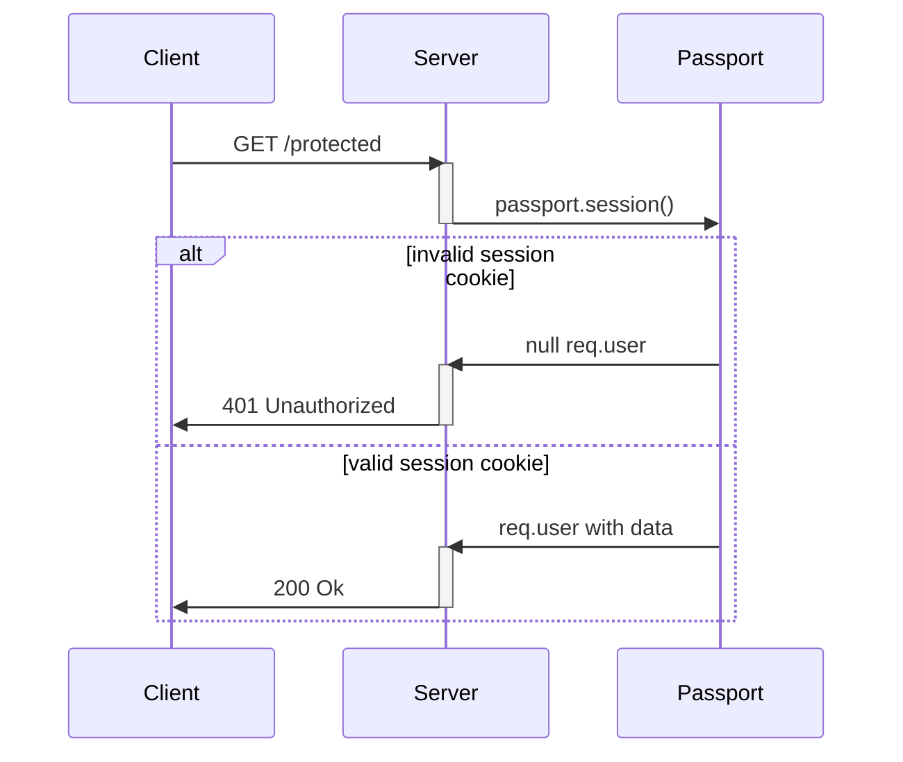
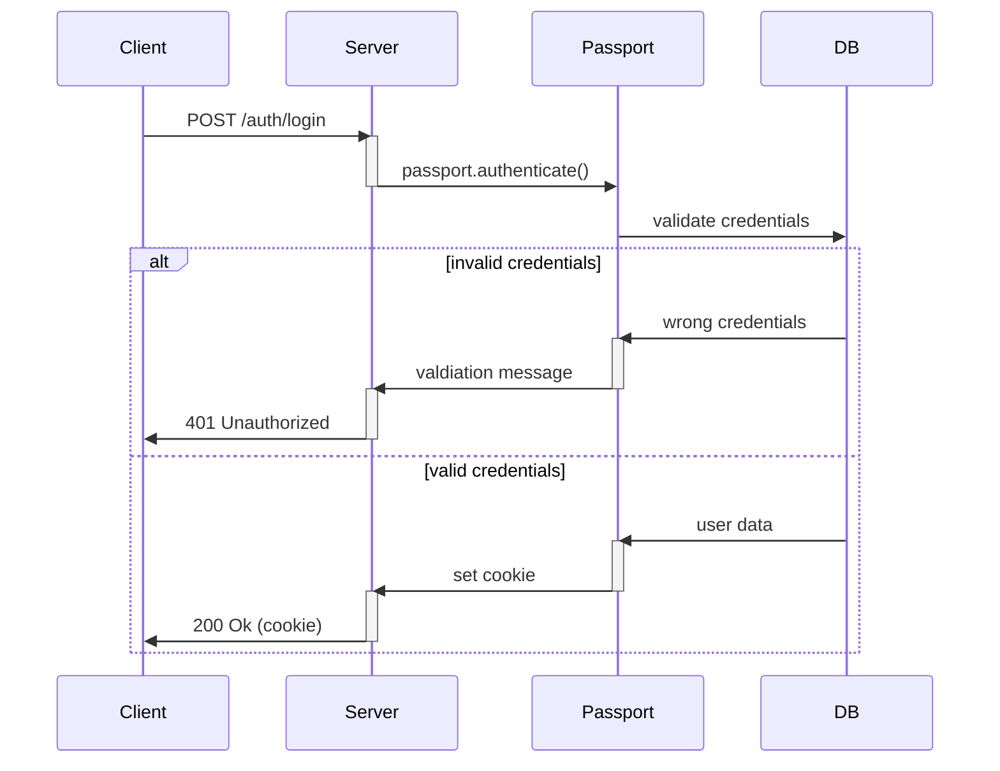

# FinMGMT (Server)

## Autentication

1. **Use of _app-auth_ cookie**

```mermaid
sequenceDiagram
   participant Client
   participant Server
   participant Passport

   Client->>Server: GET /protected
   activate Server
   Server->>Passport: passport.session()
   deactivate Server
   alt invalid session cookie
      Passport->>Server: null req.user
      activate Server
      Server->>Client: 401 Unauthorized
      deactivate Server
   else valid session cookie
      Passport->>Server: req.user with data
      activate Server
      Server->>Client: 200 Ok
      deactivate Server
   end
```

2. **Login and creation of the _app-auth_ cookie**

```mermaid
sequenceDiagram
   participant Client
   participant Server
   participant Passport

   Client->>Server: POST /auth/login
      activate Server
   Server->>Passport: passport.authenticate()
      deactivate Server
   Passport->>DB: validate credentials
   alt invalid credentials
      DB->>Passport: wrong credentials
         activate Passport
      Passport->>Server: valdiation message
         deactivate Passport
         activate Server
      Server->>Client: 401 Unauthorized
         deactivate Server
   else valid credentials
      DB->>Passport: user data
         activate Passport
      Passport->>Server: set cookie
         deactivate Passport
         activate Server
      Server->>Client: 200 Ok (cookie)
         deactivate Server
   end
```
