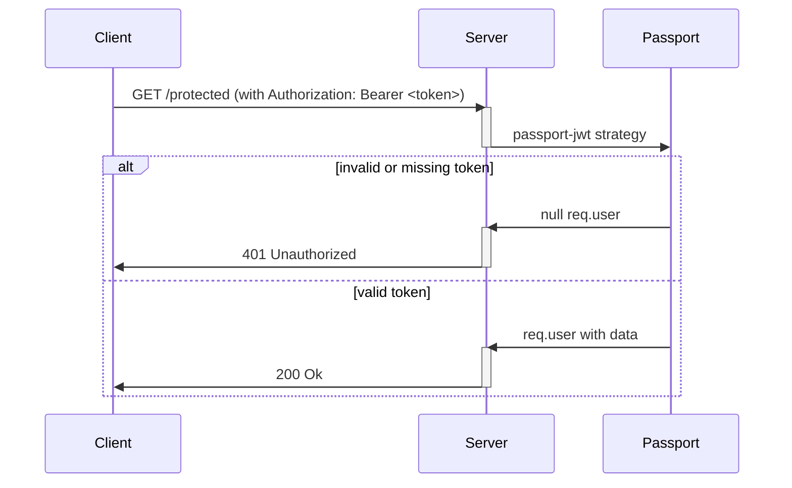
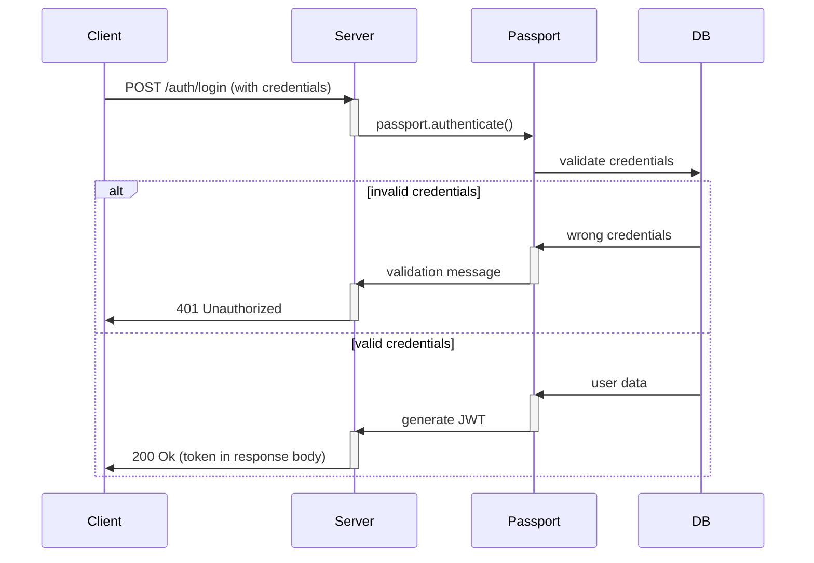

# FinMGMT (Server)

## Overview
This is the backend API for the FINK Financial Track System. It is built with Node.js, Express, and MongoDB, and provides RESTful endpoints for account management, transactions, financial goals, and authentication. The backend is designed to be used with the Angular frontend (`finkapp`).

---

## Table of Contents
- [Architecture](#architecture)
- [Environment Variables](#environment-variables)
- [Setup & Installation](#setup--installation)
- [Authentication](#authentication)
- [Running the Server](#running-the-server)
- [Running Tests](#running-tests)
- [API Documentation](#api-documentation)
- [Troubleshooting](#troubleshooting)
- [Contributing](#contributing)

---

## Architecture
- **Framework:** Node.js + Express
- **Database:** MongoDB (Dockerized)
- **Authentication:** Passport.js (session-based, cookie `_app-auth`)
- **Documentation:** Swagger (OpenAPI)

## Environment Variables
Create a `.env` file in this directory with the following variables:

| Variable         | Description                                 | Example                        |
|------------------|---------------------------------------------|--------------------------------|
| PORT             | Backend server port                         | 3000                           |
| CORS_ORIGINS     | Allowed frontend origins (comma-separated)  | http://localhost:4200          |
| MONGODB_URI      | MongoDB connection string                   | mongodb://mongo:27017/finmgmt  |
| DB_NAME          | MongoDB database name                       | finmgmt                        |

---

## Setup & Installation

### Prerequisites
- [Node.js](https://nodejs.org/) (if running outside Docker)
- [Docker](https://docs.docker.com/get-docker/) (recommended)

### With Docker (Recommended)
1. Ensure Docker is running.
2. From the project root, run:
   ```bash
   docker-compose up --build
   ```
3. The backend will be available at `http://localhost:3000`.

### Local Development (Without Docker)
1. Install dependencies:
   ```bash
   npm install
   ```
2. Start MongoDB locally or use a remote instance.
3. Create a `.env` file as described above.
4. Start the server:
   ```bash
   npm run dev
   ```

---

## Authentication
This API uses JWT (JSON Web Token) authentication. Upon successful login, the server returns a JWT in the response body. The client must include this token in the `Authorization: Bearer <token>` header for all protected routes.

### Authentication Flow (Summary)
- **Login:** Client sends credentials to `/auth/login`. If valid, server returns a JWT in the response body.
- **Token Usage:** For protected routes, the client must include the JWT in the `Authorization` header as a Bearer token. The server validates the token for access.

#### Sequence Diagrams

1. **Token Validation**


2. **Login and Token Issuance**


---

## Running the Server
- **Development:**
  ```bash
  npm run dev
  ```
- **Production:**
  ```bash
  npm start
  ```

## Running Tests
If tests are available, run:
```bash
npm test
```

---

## API Documentation
- Swagger UI is available at: `http://localhost:3000/api/docs`
- See the OpenAPI spec for all endpoints, request/response formats, and authentication requirements.

---

## Troubleshooting
- **MongoDB connection error:** Ensure MongoDB is running and the URI in `.env` is correct.
- **CORS issues:** Check `CORS_ORIGINS` in `.env` and frontend URL.
- **Session/authentication issues:** Clear cookies and try logging in again.
- **Port already in use:** Make sure nothing else is running on port 3000.

---

## Contributing
Contributions are welcome! Please open an issue or pull request for suggestions or improvements.

---
